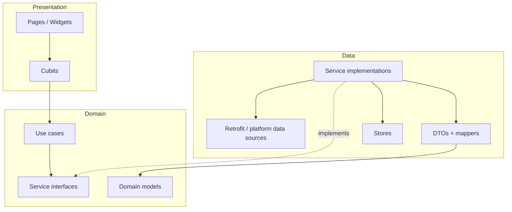

# Weather App

A Flutter weather application with Firebase authentication, location-based forecasts, city search, and localized UI. The codebase follows **clean architecture** with clear separation between domain, data, and presentation layers.

## Features

- Email/password sign-in and registration (Firebase Auth)
- Current weather by device location or city name
- English and Polish localization
- Light theme with shared design-system widgets

## Tech stack

| Area | Libraries |
|------|-----------|
| UI | Flutter, `flutter_hooks`, Material 3 |
| State | `bloc` / `flutter_bloc`, `hooked_bloc`, `bloc_presentation` |
| DI | `get_it`, `injectable` |
| Networking | `dio`, `retrofit` |
| Navigation | `go_router` |
| Auth & analytics | Firebase (Auth, Analytics, Crashlytics) |
| Location | `geolocator` |
| Persistence | `shared_preferences`, `flutter_secure_storage` |
| Logging | `fimber_io` |
| i18n | `intl` / `intl_utils` (generated `Strings`) |
| Tests | `bloc_test`, `mockito` |

SDK and Flutter versions are pinned in `pubspec.yaml`.

## Architecture overview

Dependencies point **inward**: presentation → domain ← data. The domain layer defines contracts and business models; it does not depend on Flutter UI or HTTP details.



### Layer responsibilities

| Layer | Path | Responsibility |
|-------|------|----------------|
| **Domain** | `lib/domain/` | `abstract interface class` ports (`*Service`, `*Store`), `@injectable` use cases, pure domain models. No DTOs, Dio, or widgets. |
| **Data** | `lib/data/` | `*Impl` services, Retrofit data sources, DTOs, local stores. Maps API/persistence → domain (`toDomain()`). |
| **Presentation** | `lib/presentation/` | Pages, cubits, router, reusable widgets. Calls use cases; never talks to Retrofit or DTOs directly. |

Supporting modules: `lib/style/` (theme, typography, colors), `lib/extensions/`, `lib/utils/`, `lib/networking_config/`, `lib/config/`, `lib/injectable/`.

### Feature modules

Each feature is grouped by name under domain and data, for example:

```
lib/domain/weather/
  model/current_weather.dart
  service/weather_service.dart
  use_case/get_current_weather_use_case.dart

lib/data/weather/
  data_source/weather_api_data_source.dart
  model/weather_dto.dart
  service/weather_service_impl.dart

lib/presentation/pages/home/
  home_page.dart
  cubit/home_cubit.dart
  cubit/home_state.dart
  body/
```

Similar structure exists for `auth`, `location`, and `locale`.

## Key patterns

### 1. Service port + implementation

Domain exposes a narrow interface; data provides the implementation registered with Injectable.

```dart
// domain/weather/service/weather_service.dart
abstract interface class WeatherService {
  Future<Either<GenericError, CurrentWeather>> getCurrentWeather({...});
}

// data/weather/service/weather_service_impl.dart
@LazySingleton(as: WeatherService)
class WeatherServiceImpl implements WeatherService { ... }
```

Services return `Either<GenericError, T>` so callers handle success and failure explicitly without exceptions crossing layer boundaries for expected errors.

### 2. Use cases

Use cases wrap a single application action and delegate to services. They are `@injectable` and expose a `call()` method.

```dart
@injectable
class GetCurrentWeatherUseCase {
  final WeatherService _weatherService;
  const GetCurrentWeatherUseCase(this._weatherService);

  Future<Either<GenericError, CurrentWeather>> call({...}) =>
      _weatherService.getCurrentWeather(...);
}
```

Cubits depend on use cases (not services directly), keeping presentation logic thin.

### 3. Data sources and DTO mapping

HTTP APIs are defined with Retrofit in `lib/data/**/data_source/`. DTOs use `json_serializable`; mapping to domain lives in the data layer via extensions:

```dart
extension WeatherDtoMapper on WeatherDto {
  CurrentWeather toDomain() => CurrentWeather(...);
}
```

### 4. Either-based error handling

`lib/utils/error_handling/either.dart` defines `Success` / `Failure` and helpers (`fold`, `map`, `flatMap`). Typed errors extend `GenericError` (e.g. `HttpError`, auth errors). Services catch expected exceptions (e.g. `DioException`) and return `Failure`; unexpected errors are logged and mapped to a generic failure.

### 5. Cubits and state

- Cubits extend `SafetyCubit<State>`, which guards `emit` when the cubit is already closed.
- State classes are typically **sealed** hierarchies extending `Equatable` (e.g. `HomeStateLoading`, `HomeStateLoaded`, `HomeStateError`).
- Cubits are `@injectable` and receive use cases via constructor injection.

### 6. Presentation events (one-shot UI actions)

Navigation, snackbars, and dialogs must not live in state. Use `bloc_presentation`:

1. Define a `sealed class` in `*_presentation_event.dart`.
2. Mix in `BlocPresentationMixin<State, PresentationEvent>` on the cubit.
3. Call `emitPresentation(...)` for one-shot actions.
4. Listen with `useOnStreamChange(cubit.presentation, ...)` in the page — not `BlocListener` for these events.

Example flow after login: emit loaded state, then `emitPresentation(LoginNavigateHomeEvent())`; the page listener calls `context.goNamed(...)`.

### 7. UI: HookWidget + hooked_bloc

Pages are `HookWidget`s. Cubits are resolved from GetIt via `useBloc<MyCubit>()` (configured in `WeatherApp` through `HookedBlocConfigProvider`). State is observed with `useBlocBuilder`. Initial loads often use `useOnce(cubit.init)`.

Do **not** create cubits with `BlocProvider(create: ...)` for page-level cubits — the global injector supplies them.

### 8. Routing

- Route paths and names: `WeatherAppRoutes` enum (`lib/presentation/router/weather_app_routes.dart`).
- Router setup: `lib/presentation/router/router.dart` (`go_router`, shell for main tabs).
- Navigate with `context.goNamed(WeatherAppRoutes.home.name)` (or `go` / `push` as appropriate).

### 9. Session handling

`SessionExpirationChecker` wraps the app and reacts to auth state: redirects to home when authenticated, to splash when not.

## Dependency injection

- Entry: `lib/injectable/injectable.dart` → `configureDependencies(environment)`.
- Registrations are generated in `injectable.config.dart` (do not edit by hand).
- Environments: `dev`, `prod`, and custom `staging` (`StagingEnvironment`).
- External modules: e.g. `Dio`, `FirebaseAuth`, `SharedPreferences` in `lib/injectable/`.
- Tests can swap implementations with `registerOverride<T>(() => mock)`.

After adding or changing `@injectable`, `@LazySingleton`, Retrofit clients, or `@JsonSerializable` classes:

```bash
dart run build_runner build --delete-conflicting-outputs
```

## Project layout (abbreviated)

```
lib/
  main.dart                 # Firebase, DI, runApp
  weather_app.dart          # MaterialApp.router, l10n, session checker
  config/                   # Environments, Firebase options
  domain/                   # Ports, models, use cases
  data/                     # Implementations, DTOs, APIs
  presentation/
    pages/                  # Feature screens + cubits
    router/
    widgets/                # Shared UI components
  style/                    # Theme, colors, typography
  utils/                    # Either, SafetyCubit, hooks helpers
  generated/                # l10n, assets (generated)
  injectable/               # DI modules + generated config
  networking_config/        # Endpoints, query params
test/
  unit_tests/               # Mirrors lib/ structure
  widget_tests/
integration_test/
l10n/                       # ARB translation files
assets/
```

## Running the app

```bash
# Install dependencies
flutter pub get

# Run (default prod environment)
flutter run

# Run with a specific environment
flutter run --dart-define=ENVIRONMENT=dev
flutter run --dart-define=ENVIRONMENT=staging
```

`getEnvironment()` reads the `ENVIRONMENT` dart-define (`lib/config/get_environment.dart`). Production uses the value `production`, mapped internally to Injectable’s `prod` environment.

## Testing

| Type | Location |
|------|----------|
| Unit | `test/unit_tests/` — use cases, services, cubits |
| Widget | `test/widget_tests/` |
| Integration | `integration_test/` |

Mocks are generated with Mockito (`@GenerateMocks`, `*.mocks.dart`). Use `registerOverride` in tests to inject mocks into GetIt.

Example:

```bash
flutter test test/unit_tests/
flutter test
```

## Code style and generated files

- Package imports only: `package:weather_app/...` (no `../` across `lib/`).
- Format with `dart format` (120-character page width in `analysis_options.yaml`).
- **Do not hand-edit**: `*.g.dart`, `*.mocks.dart`, `lib/generated/**`, `lib/injectable/injectable.config.dart`.

For contributor/agent-oriented notes (codegen checklist, lint rules), see [AGENTS.md](AGENTS.md).

## Data flow example: home screen

1. `HomePage` calls `useOnce(cubit.init)`.
2. `HomeCubit` reads language via `GetSelectedLanguageCodeUseCase`, checks location permission, fetches coordinates, then calls `GetCurrentWeatherUseCase`.
3. `GetCurrentWeatherUseCase` → `WeatherService` → `WeatherServiceImpl` → `WeatherApiDataSource` (Retrofit).
4. `WeatherDto.toDomain()` produces `CurrentWeather`.
5. Cubit `emit`s `HomeStateLoaded` or `HomeStateError`; the page `switch`es on sealed state to show body, loading, or error UI.

## CI

Build and release configuration lives in `codemagic.yaml`.
